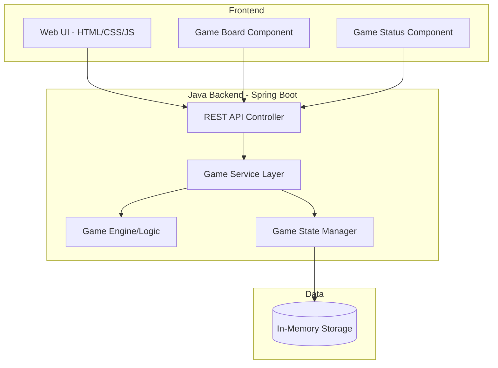
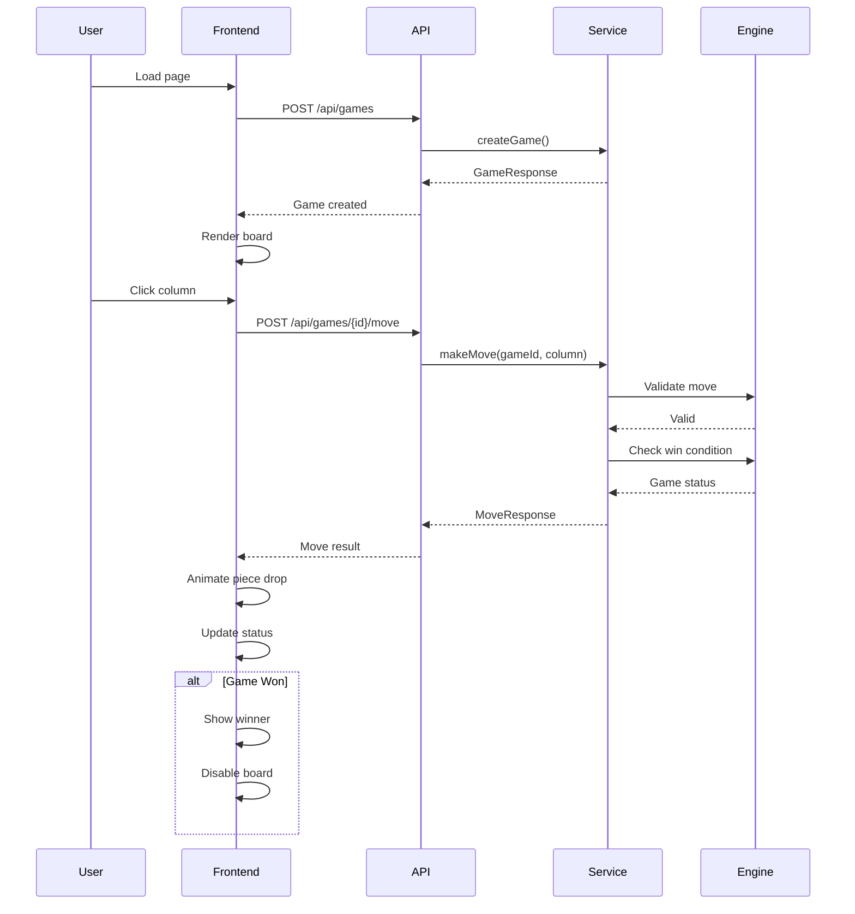

# Connect 4 Game - Architecture Plan

## Overview
This document outlines the architecture for a full-stack Connect 4 game application with a Java backend and modern web frontend.

## System Architecture



---

## Backend Architecture (Java)

### Technology Stack
- **Framework**: Spring Boot 3.x
- **Build Tool**: Maven
- **Java Version**: Java 17+
- **Storage**: In-memory (HashMap) for simplicity

### Package Structure
```
com.connect4
├── controller
│   └── GameController.java
├── service
│   ├── GameService.java
│   └── GameServiceImpl.java
├── model
│   ├── Game.java
│   ├── Board.java
│   ├── Player.java
│   ├── Move.java
│   └── GameStatus.java
├── engine
│   └── GameEngine.java
├── dto
│   ├── GameResponse.java
│   ├── MoveRequest.java
│   └── MoveResponse.java
└── exception
    ├── InvalidMoveException.java
    └── GameNotFoundException.java
```

---

## Backend Classes

### 1. **Model Classes**

#### `Player.java` (Enum)
```java
public enum Player {
    RED, YELLOW, NONE
}
```
**Purpose**: Represents the two players and empty cells

---

#### `GameStatus.java` (Enum)
```java
public enum GameStatus {
    IN_PROGRESS, RED_WINS, YELLOW_WINS, DRAW
}
```
**Purpose**: Represents the current state of the game

---

#### `Board.java`
**Fields**:
- `Player[][] grid` - 6x7 grid representing the game board
- `int ROWS = 6` - Number of rows (constant)
- `int COLS = 7` - Number of columns (constant)

**Methods**:
- `Board()` - Constructor, initializes empty board
- `boolean isColumnFull(int column)` - Check if column is full
- `int dropPiece(int column, Player player)` - Drop piece in column, returns row
- `Player getCell(int row, int col)` - Get player at position
- `Player[][] getGrid()` - Get entire board state
- `void reset()` - Reset board to empty state

**Purpose**: Manages the game board state and piece placement

---

#### `Move.java`
**Fields**:
- `int column` - Column where piece was dropped
- `int row` - Row where piece landed
- `Player player` - Player who made the move
- `LocalDateTime timestamp` - When move was made

**Methods**:
- `Move(int column, int row, Player player)` - Constructor
- Getters and setters for all fields

**Purpose**: Represents a single move in the game

---

#### `Game.java`
**Fields**:
- `String gameId` - Unique identifier for the game
- `Board board` - The game board
- `Player currentPlayer` - Whose turn it is
- `GameStatus status` - Current game status
- `List<Move> moveHistory` - History of all moves
- `LocalDateTime createdAt` - Game creation timestamp
- `LocalDateTime lastMoveAt` - Last move timestamp

**Methods**:
- `Game(String gameId)` - Constructor
- `void addMove(Move move)` - Add move to history
- `void switchPlayer()` - Toggle current player
- Getters and setters for all fields

**Purpose**: Represents a complete game session

---

### 2. **Engine Classes**

#### `GameEngine.java`
**Fields**:
- `private static final int CONNECT_COUNT = 4` - Pieces needed to win

**Methods**:
- `GameStatus checkWin(Board board, int lastRow, int lastCol, Player player)` - Check if last move won
- `boolean checkDirection(Board board, int row, int col, int dRow, int dCol, Player player)` - Check specific direction for 4-in-a-row
- `boolean isBoardFull(Board board)` - Check for draw condition
- `int countConsecutive(Board board, int row, int col, int dRow, int dCol, Player player)` - Count consecutive pieces in direction

**Purpose**: Contains all game logic for win detection and validation

---

### 3. **Service Layer**

#### `GameService.java` (Interface)
**Methods**:
- `GameResponse createGame()` - Create new game
- `GameResponse getGame(String gameId)` - Get game state
- `MoveResponse makeMove(String gameId, MoveRequest request)` - Make a move
- `GameResponse resetGame(String gameId)` - Reset existing game
- `void deleteGame(String gameId)` - Delete game

---

#### `GameServiceImpl.java`
**Fields**:
- `Map<String, Game> games` - In-memory storage of active games
- `GameEngine gameEngine` - Reference to game engine

**Methods**:
- Implements all methods from `GameService` interface
- `String generateGameId()` - Generate unique game ID

**Purpose**: Business logic layer managing game operations

---

### 4. **Controller Layer**

#### `GameController.java`
**Annotations**: `@RestController`, `@RequestMapping("/api/games")`

**Endpoints**:
- `POST /api/games` - Create new game
  - Returns: `GameResponse`
  
- `GET /api/games/{gameId}` - Get game state
  - Returns: `GameResponse`
  
- `POST /api/games/{gameId}/move` - Make a move
  - Body: `MoveRequest { column: int }`
  - Returns: `MoveResponse`
  
- `POST /api/games/{gameId}/reset` - Reset game
  - Returns: `GameResponse`
  
- `DELETE /api/games/{gameId}` - Delete game
  - Returns: `204 No Content`

**Purpose**: REST API endpoints for game operations

---

### 5. **DTO Classes**

#### `GameResponse.java`
**Fields**:
- `String gameId`
- `Player[][] board`
- `Player currentPlayer`
- `GameStatus status`
- `String message`
- `List<Move> moveHistory`

**Purpose**: Response object for game state

---

#### `MoveRequest.java`
**Fields**:
- `int column` - Column to drop piece (0-6)

**Purpose**: Request object for making a move

---

#### `MoveResponse.java`
**Fields**:
- `boolean success`
- `String message`
- `Move move`
- `GameStatus gameStatus`
- `Player[][] board`
- `Player winner` (nullable)

**Purpose**: Response object for move operations

---

### 6. **Exception Classes**

#### `InvalidMoveException.java`
**Extends**: `RuntimeException`

**Purpose**: Thrown when invalid move is attempted

---

#### `GameNotFoundException.java`
**Extends**: `RuntimeException`

**Purpose**: Thrown when game ID doesn't exist

---

## Frontend Architecture

### Technology Stack
- **Core**: HTML5, CSS3, Vanilla JavaScript
- **Styling**: Modern CSS with animations and gradients
- **HTTP Client**: Fetch API

### File Structure
```
frontend/
├── index.html
├── css/
│   └── styles.css
└── js/
    ├── app.js
    ├── game.js
    └── api.js
```

### Frontend Components

#### `index.html`
**Structure**:
- Game board container (7 columns × 6 rows)
- Status display (current player, game status)
- Control buttons (New Game, Reset)
- Move history panel

---

#### `styles.css`
**Features**:
- Responsive grid layout for game board
- Animated piece drops
- Hover effects on columns
- Winning animation
- Modern color scheme with gradients
- Dark mode support

---

#### `api.js`
**Functions**:
- `createGame()` - POST to create new game
- `getGame(gameId)` - GET game state
- `makeMove(gameId, column)` - POST move
- `resetGame(gameId)` - POST reset

**Purpose**: API communication layer

---

#### `game.js`
**Functions**:
- `renderBoard(boardData)` - Render game board
- `handleColumnClick(column)` - Handle user click
- `animatePieceDrop(column, row, player)` - Animate piece falling
- `updateStatus(status, currentPlayer)` - Update status display
- `highlightWinningPieces(winningCells)` - Highlight winning combination
- `disableBoard()` / `enableBoard()` - Toggle interactivity

**Purpose**: Game UI logic and rendering

---

#### `app.js`
**Functions**:
- `initGame()` - Initialize new game on load
- `setupEventListeners()` - Attach event handlers
- `handleNewGame()` - Create new game
- `handleReset()` - Reset current game

**Purpose**: Main application controller

---

## API Specification

### Base URL
```
http://localhost:8080/api/games
```

### Endpoints

#### 1. Create Game
```http
POST /api/games
```

**Response** (200 OK):
```json
{
  "gameId": "abc123",
  "board": [[null, null, ...], ...],
  "currentPlayer": "RED",
  "status": "IN_PROGRESS",
  "message": "Game created successfully",
  "moveHistory": []
}
```

---

#### 2. Get Game State
```http
GET /api/games/{gameId}
```

**Response** (200 OK):
```json
{
  "gameId": "abc123",
  "board": [["RED", "YELLOW", null, ...], ...],
  "currentPlayer": "RED",
  "status": "IN_PROGRESS",
  "message": "Game in progress",
  "moveHistory": [...]
}
```

---

#### 3. Make Move
```http
POST /api/games/{gameId}/move
Content-Type: application/json

{
  "column": 3
}
```

**Response** (200 OK):
```json
{
  "success": true,
  "message": "Move successful",
  "move": {
    "column": 3,
    "row": 5,
    "player": "RED",
    "timestamp": "2025-12-01T11:54:49"
  },
  "gameStatus": "IN_PROGRESS",
  "board": [[...], ...],
  "winner": null
}
```

**Response** (400 Bad Request) - Invalid Move:
```json
{
  "success": false,
  "message": "Column is full",
  "move": null,
  "gameStatus": "IN_PROGRESS",
  "board": [[...], ...],
  "winner": null
}
```

---

#### 4. Reset Game
```http
POST /api/games/{gameId}/reset
```

**Response** (200 OK):
```json
{
  "gameId": "abc123",
  "board": [[null, null, ...], ...],
  "currentPlayer": "RED",
  "status": "IN_PROGRESS",
  "message": "Game reset successfully",
  "moveHistory": []
}
```

---

#### 5. Delete Game
```http
DELETE /api/games/{gameId}
```

**Response** (204 No Content)

---

## Game Flow



---

## Win Detection Algorithm

The `GameEngine` checks for wins by examining 4 directions from the last placed piece:

1. **Horizontal** (left-right): `(0, ±1)`
2. **Vertical** (up-down): `(±1, 0)`
3. **Diagonal** (top-left to bottom-right): `(±1, ±1)`
4. **Anti-diagonal** (top-right to bottom-left): `(±1, ∓1)`

For each direction, count consecutive pieces of the same player. If count ≥ 4, player wins.

---

## Data Flow

### Making a Move
1. User clicks column in frontend
2. Frontend sends `POST /api/games/{gameId}/move` with column number
3. Controller receives request, calls `GameService.makeMove()`
4. Service validates:
   - Game exists
   - Game is in progress
   - Column is valid (0-6)
   - Column is not full
5. Service drops piece on board
6. Service calls `GameEngine.checkWin()` to check for winner
7. Service updates game status
8. Service returns `MoveResponse` with updated board
9. Frontend animates piece drop
10. Frontend updates UI with new game state

---

## Error Handling

### Backend Exceptions
- `GameNotFoundException` → 404 Not Found
- `InvalidMoveException` → 400 Bad Request
- Generic exceptions → 500 Internal Server Error

### Frontend Error Handling
- Display error messages to user
- Prevent invalid moves (disable full columns)
- Handle network errors gracefully
- Retry logic for failed requests

---

## Future Enhancements

> [!NOTE]
> These features are not included in the initial implementation but can be added later:

- **Multiplayer**: WebSocket support for real-time 2-player games
- **AI Opponent**: Minimax algorithm for single-player mode
- **Persistence**: Database storage (PostgreSQL/MongoDB)
- **User Accounts**: Authentication and player profiles
- **Game History**: Save and replay past games
- **Leaderboard**: Track wins/losses
- **Themes**: Customizable board colors and styles
- **Sound Effects**: Audio feedback for moves and wins
- **Undo/Redo**: Move history navigation

---

## Development Phases

### Phase 1: Backend Development
- [ ] Set up Spring Boot project
- [ ] Implement model classes
- [ ] Implement game engine and win detection
- [ ] Implement service layer
- [ ] Implement REST API controllers
- [ ] Add exception handling
- [ ] Test all endpoints

### Phase 2: Frontend Development
- [ ] Create HTML structure
- [ ] Design CSS styling with animations
- [ ] Implement API client
- [ ] Implement game rendering logic
- [ ] Add user interactions
- [ ] Add animations and effects

### Phase 3: Integration & Testing
- [ ] Connect frontend to backend
- [ ] End-to-end testing
- [ ] Bug fixes and refinements
- [ ] Performance optimization

---

## Configuration

### Backend Configuration (`application.properties`)
```properties
server.port=8080
spring.application.name=connect4-game

# CORS configuration
cors.allowed-origins=http://localhost:3000,http://127.0.0.1:3000
```

### Frontend Configuration
- Update API base URL in `api.js` to match backend server
- Configure CORS if frontend served from different port

---

## Summary

This architecture provides a clean separation of concerns:

- **Backend**: Java/Spring Boot handles all game logic, validation, and state management
- **Frontend**: Modern web UI provides interactive gameplay experience
- **API**: RESTful interface enables loose coupling between layers

The design is scalable and maintainable, with clear responsibilities for each component.
