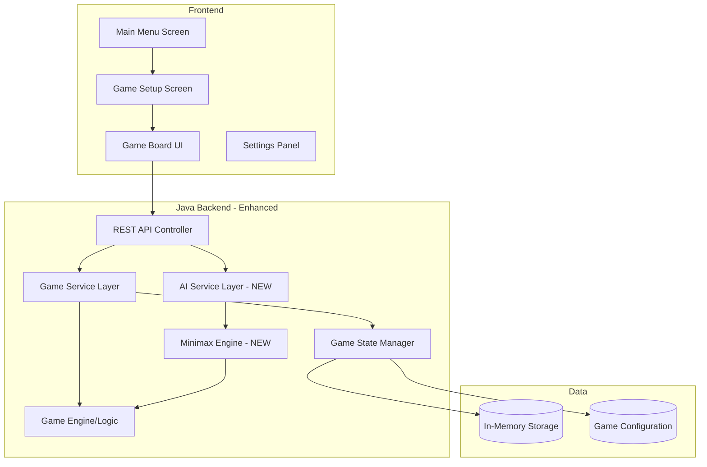
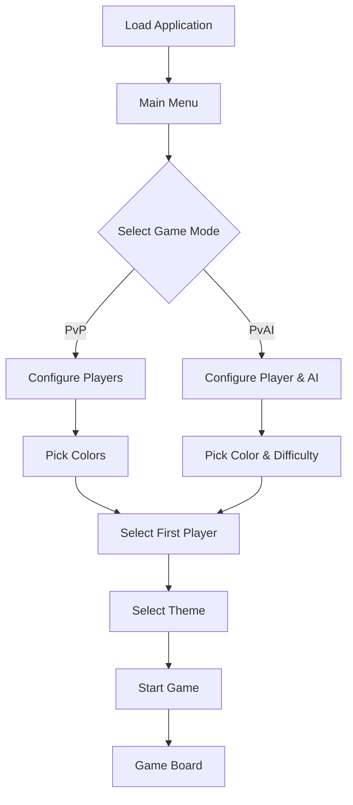
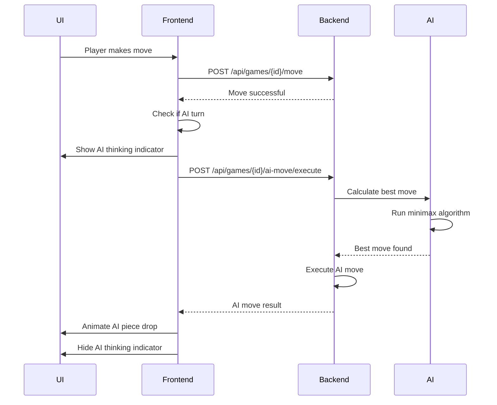

# Connect 4 Game - Architecture Plan v1.0

## Overview
This document outlines the architecture enhancements for Connect 4 v1.0, adding:
- **AI Opponent** with Minimax algorithm
- **Main Menu** with game mode selection
- **Color Customization** for players
- **Enhanced Game Modes**: Player vs Player, Player vs AI

---

## New Features Summary

### 1. Main Menu System
- Game mode selection (PvP vs PvAI)
- Player color customization
- Difficulty level selection for AI
- Visual theme selection

### 2. AI Opponent
- Minimax algorithm with alpha-beta pruning
- Multiple difficulty levels (Easy, Medium, Hard)
- Intelligent move evaluation
- Response time simulation for better UX

### 3. Enhanced Game Configuration
- Customizable player colors
- Player names
- First player selection
- Game settings persistence

---

## System Architecture Updates



---

## Backend Architecture Enhancements

### New Package Structure
```
com.connect4
├── controller
│   ├── GameController.java (ENHANCED)
│   └── GlobalExceptionHandler.java
├── service
│   ├── GameService.java (ENHANCED)
│   ├── GameServiceImpl.java (ENHANCED)
│   ├── AIService.java (NEW)
│   └── AIServiceImpl.java (NEW)
├── model
│   ├── Player.java
│   ├── GameStatus.java
│   ├── Board.java
│   ├── Move.java
│   ├── Game.java (ENHANCED)
│   ├── GameMode.java (NEW)
│   ├── GameConfiguration.java (NEW)
│   ├── PlayerConfig.java (NEW)
│   └── AIDifficulty.java (NEW)
├── engine
│   ├── GameEngine.java
│   ├── MinimaxEngine.java (NEW)
│   └── MoveEvaluator.java (NEW)
├── dto
│   ├── GameResponse.java (ENHANCED)
│   ├── MoveRequest.java
│   ├── MoveResponse.java
│   ├── GameConfigRequest.java (NEW)
│   └── AIMoveResponse.java (NEW)
└── exception
    ├── InvalidMoveException.java
    ├── GameNotFoundException.java
    └── InvalidConfigurationException.java (NEW)
```

---

## New Backend Classes

### 1. Model Classes (NEW)

#### `GameMode.java` (Enum)
```java
public enum GameMode {
    PLAYER_VS_PLAYER,
    PLAYER_VS_AI
}
```
**Purpose**: Represents the game mode

---

#### `AIDifficulty.java` (Enum)
```java
public enum AIDifficulty {
    EASY(2),      // Depth 2
    MEDIUM(4),    // Depth 4
    HARD(6);      // Depth 6
    
    private final int searchDepth;
}
```
**Purpose**: AI difficulty levels with corresponding search depths

---

#### `PlayerConfig.java`
**Fields**:
- `String name` - Player name
- `String color` - Player color (hex code or preset)
- `boolean isAI` - Whether this player is AI
- `AIDifficulty aiDifficulty` - AI difficulty (if AI player)

**Methods**:
- `PlayerConfig(String name, String color, boolean isAI)`
- Getters and setters

**Purpose**: Configuration for a single player

---

#### `GameConfiguration.java`
**Fields**:
- `GameMode gameMode` - Game mode (PvP or PvAI)
- `PlayerConfig player1Config` - First player configuration
- `PlayerConfig player2Config` - Second player configuration
- `Player firstPlayer` - Who starts (RED or YELLOW)
- `boolean enableSounds` - Sound effects toggle
- `String theme` - Visual theme name

**Methods**:
- `GameConfiguration()`
- `boolean hasAIPlayer()` - Check if any player is AI
- `PlayerConfig getAIPlayerConfig()` - Get AI player config
- Getters and setters

**Purpose**: Complete game configuration

---

### 2. Enhanced Model Classes

#### `Game.java` (ENHANCED)
**New Fields**:
- `GameConfiguration configuration` - Game configuration
- `boolean isAIThinking` - AI processing state

**New Methods**:
- `boolean isAITurn()` - Check if current player is AI
- `PlayerConfig getCurrentPlayerConfig()` - Get current player's config

---

### 3. AI Service Layer (NEW)

#### `AIService.java` (Interface)
**Methods**:
- `AIMoveResponse calculateBestMove(String gameId)` - Calculate AI's best move
- `int evaluateBoard(Board board, Player player)` - Evaluate board position
- `List<Integer> getValidMoves(Board board)` - Get all valid columns

---

#### `AIServiceImpl.java`
**Fields**:
- `MinimaxEngine minimaxEngine` - Reference to minimax engine
- `GameService gameService` - Reference to game service
- `Random random` - For easy mode randomness

**Methods**:
- Implements all methods from `AIService` interface
- `int getRandomMove(Board board)` - Random move for easy mode
- `int getSmartMove(Board board, Player player, int depth)` - Minimax move

**Purpose**: AI decision-making service

---

### 4. AI Engine Layer (NEW)

#### `MinimaxEngine.java`
**Fields**:
- `private static final int WIN_SCORE = 100000`
- `private static final int DRAW_SCORE = 0`
- `private static final int[] COLUMN_WEIGHTS = {3, 4, 5, 7, 5, 4, 3}` - Center preference

**Methods**:
- `int minimax(Board board, int depth, int alpha, int beta, boolean isMaximizing, Player player)` - Minimax with alpha-beta pruning
- `int evaluatePosition(Board board, Player player)` - Static position evaluation
- `int scoreWindow(List<Player> window, Player player)` - Score a 4-cell window
- `int findBestMove(Board board, Player player, int depth)` - Find optimal move

**Purpose**: Minimax algorithm implementation

---

#### `MoveEvaluator.java`
**Methods**:
- `int evaluateMove(Board board, int column, Player player)` - Evaluate single move
- `boolean isWinningMove(Board board, int column, Player player)` - Check if move wins
- `boolean isBlockingMove(Board board, int column, Player player)` - Check if move blocks opponent
- `int countThreats(Board board, Player player)` - Count potential winning positions

**Purpose**: Move evaluation utilities

---

### 5. New DTO Classes

#### `GameConfigRequest.java`
**Fields**:
- `GameMode gameMode`
- `PlayerConfig player1Config`
- `PlayerConfig player2Config`
- `Player firstPlayer`
- `String theme`

**Validation**:
- `@NotNull` on required fields
- Custom validation for AI configuration

**Purpose**: Request object for game creation with configuration

---

#### `AIMoveResponse.java`
**Fields**:
- `int column` - Chosen column
- `int evaluationScore` - Board evaluation score
- `int thinkingTimeMs` - Simulated thinking time
- `String reasoning` - Human-readable explanation (optional)

**Purpose**: Response object for AI move calculations

---

### 6. Enhanced DTO Classes

#### `GameResponse.java` (ENHANCED)
**New Fields**:
- `GameConfiguration configuration` - Game configuration
- `boolean isAITurn` - Whether AI should move next
- `PlayerConfig currentPlayerConfig` - Current player's configuration

---

### 7. Enhanced Controller

#### `GameController.java` (ENHANCED)

**New Endpoints**:

```java
// Create game with configuration
POST /api/games/configured
Body: GameConfigRequest
Returns: GameResponse

// Request AI move
POST /api/games/{gameId}/ai-move
Returns: AIMoveResponse

// Get AI move and execute it
POST /api/games/{gameId}/ai-move/execute
Returns: MoveResponse
```

**Updated Endpoints**:
- `POST /api/games` - Now supports optional configuration in request body

---

## AI Algorithm Details

### Minimax with Alpha-Beta Pruning

#### Algorithm Flow
```
1. Generate all valid moves
2. For each move:
   a. Simulate move on board copy
   b. Recursively evaluate resulting position
   c. Apply alpha-beta pruning to skip branches
3. Return move with highest evaluation score
```

#### Evaluation Function
```
Score = 
  + WIN_SCORE (if winning position)
  + DRAW_SCORE (if draw)
  + Sum of all 4-cell window scores
  + Center column preference bonus
  + Threat detection bonus
```

#### Window Scoring
- 4 in a row: +100,000 (win)
- 3 in a row + empty: +100
- 2 in a row + 2 empty: +10
- Opponent's 3 in a row: -80 (block)

#### Difficulty Levels
- **Easy** (Depth 2): 
  - 50% random moves
  - 50% minimax with depth 2
  - Fast response (~100ms)
  
- **Medium** (Depth 4):
  - Full minimax with depth 4
  - Moderate response (~500ms)
  
- **Hard** (Depth 6):
  - Full minimax with depth 6
  - Alpha-beta pruning optimization
  - Longer response (~1-2s)

---

## Frontend Architecture Enhancements

### New File Structure
```
frontend/
├── index.html (ENHANCED)
├── menu.html (NEW)
├── css/
│   ├── styles.css (ENHANCED)
│   ├── menu.css (NEW)
│   └── themes.css (NEW)
└── js/
    ├── api.js (ENHANCED)
    ├── game.js (ENHANCED)
    ├── app.js (ENHANCED)
    ├── menu.js (NEW)
    ├── ai-handler.js (NEW)
    └── config.js (NEW)
```

---

### New Frontend Components

#### `menu.html`
**Structure**:
- Welcome screen
- Game mode selection cards (PvP / PvAI)
- Player configuration panel
  - Player 1 name and color picker
  - Player 2 name and color picker (or AI difficulty)
- First player selection
- Theme selector
- Start game button

---

#### `menu.css`
**Features**:
- Card-based layout for game modes
- Color picker component styling
- Animated transitions between screens
- Difficulty selector with visual indicators
- Theme preview cards

---

#### `themes.css`
**Themes**:
- Classic (current design)
- Ocean Blue
- Sunset Orange
- Forest Green
- Neon Cyberpunk

**Variables per theme**:
- Primary colors
- Background gradients
- Piece colors
- Accent colors

---

#### `menu.js`
**Class**: `MenuController`

**Methods**:
- `initMenu()` - Initialize menu screen
- `handleGameModeSelection(mode)` - Handle mode selection
- `handleColorSelection(player, color)` - Handle color picker
- `handleDifficultySelection(difficulty)` - Handle AI difficulty
- `validateConfiguration()` - Validate settings
- `startGame()` - Create game and navigate to board
- `loadSavedSettings()` - Load from localStorage
- `saveSettings(config)` - Save to localStorage

---

#### `ai-handler.js`
**Class**: `AIHandler`

**Methods**:
- `requestAIMove(gameId)` - Request AI move from backend
- `executeAIMove(gameId)` - Request and execute AI move
- `showAIThinking()` - Display thinking indicator
- `hideAIThinking()` - Hide thinking indicator
- `animateAIThinking(duration)` - Animated thinking state

---

#### `config.js`
**Purpose**: Configuration management

**Functions**:
- `saveGameConfig(config)` - Save to localStorage
- `loadGameConfig()` - Load from localStorage
- `getDefaultConfig()` - Get default configuration
- `validateConfig(config)` - Validate configuration object

---

### Enhanced Frontend Components

#### `index.html` (ENHANCED)
**New Elements**:
- AI thinking indicator
- Player name displays
- Custom color displays
- Back to menu button
- Settings panel

---

#### `styles.css` (ENHANCED)
**New Styles**:
- Custom color support for pieces
- AI thinking animation
- Player name badges
- Settings panel styling
- Theme switching support

---

#### `game.js` (ENHANCED)
**New Methods**:
- `applyCustomColors(player1Color, player2Color)` - Apply custom colors
- `updatePlayerNames(player1Name, player2Name)` - Update name displays
- `showAIThinking()` - Show AI thinking state
- `hideAIThinking()` - Hide AI thinking state

---

#### `app.js` (ENHANCED)
**New Methods**:
- `initWithConfig(config)` - Initialize game with configuration
- `handleAITurn()` - Handle AI's turn
- `waitForAI()` - Wait for AI move
- `applyTheme(themeName)` - Apply visual theme

---

#### `api.js` (ENHANCED)
**New Methods**:
- `createGameWithConfig(config)` - Create configured game
- `requestAIMove(gameId)` - Request AI move
- `executeAIMove(gameId)` - Execute AI move

---

## User Flow

### Main Menu Flow


### AI Turn Flow


---

## API Specification Updates

### New Endpoints

#### 1. Create Configured Game
```http
POST /api/games/configured
Content-Type: application/json

{
  "gameMode": "PLAYER_VS_AI",
  "player1Config": {
    "name": "Alice",
    "color": "#FF3366",
    "isAI": false
  },
  "player2Config": {
    "name": "AI Bot",
    "color": "#FFD700",
    "isAI": true,
    "aiDifficulty": "MEDIUM"
  },
  "firstPlayer": "RED",
  "theme": "classic"
}
```

**Response** (201 Created):
```json
{
  "gameId": "abc123",
  "board": [[null, null, ...], ...],
  "currentPlayer": "RED",
  "status": "IN_PROGRESS",
  "configuration": {
    "gameMode": "PLAYER_VS_AI",
    "player1Config": {...},
    "player2Config": {...}
  },
  "isAITurn": false,
  "currentPlayerConfig": {...}
}
```

---

#### 2. Request AI Move
```http
POST /api/games/{gameId}/ai-move
```

**Response** (200 OK):
```json
{
  "column": 3,
  "evaluationScore": 450,
  "thinkingTimeMs": 750,
  "reasoning": "Blocking opponent's three in a row"
}
```

---

#### 3. Execute AI Move
```http
POST /api/games/{gameId}/ai-move/execute
```

**Response** (200 OK):
```json
{
  "success": true,
  "message": "AI move successful",
  "move": {
    "column": 3,
    "row": 4,
    "player": "YELLOW",
    "timestamp": "2025-12-01T12:56:04"
  },
  "gameStatus": "IN_PROGRESS",
  "board": [[...], ...],
  "winner": null
}
```

---

## Configuration Storage

### LocalStorage Schema
```javascript
{
  "connect4_config": {
    "lastGameMode": "PLAYER_VS_AI",
    "player1": {
      "name": "Player 1",
      "color": "#FF3366"
    },
    "player2": {
      "name": "Player 2",
      "color": "#FFD700"
    },
    "aiDifficulty": "MEDIUM",
    "theme": "classic",
    "soundEnabled": true
  }
}
```

---

## Color Customization

### Supported Color Formats
- Hex codes: `#FF3366`
- Preset colors: `red`, `blue`, `green`, `yellow`, `purple`, `orange`
- RGB: `rgb(255, 51, 102)`

### Color Picker Implementation
- HTML5 `<input type="color">`
- Preset color palette
- Recent colors history
- Contrast validation (ensure visibility)

### Custom Color Application
```css
.piece.player1 {
  background: linear-gradient(135deg, var(--player1-color) 0%, var(--player1-color-light) 100%);
}

.piece.player2 {
  background: linear-gradient(135deg, var(--player2-color) 0%, var(--player2-color-light) 100%);
}
```

---

## Performance Considerations

### AI Performance
- **Memoization**: Cache board evaluations
- **Move ordering**: Evaluate center columns first
- **Iterative deepening**: Start with shallow depth
- **Time limits**: Maximum 3 seconds per move
- **Web Worker**: Run AI in background thread (future enhancement)

### Frontend Performance
- **Lazy loading**: Load menu and game screens separately
- **CSS animations**: Use GPU-accelerated transforms
- **Debouncing**: Debounce color picker changes
- **LocalStorage**: Async read/write operations

---

## Testing Strategy

### Backend Testing
- **Unit Tests**:
  - Minimax algorithm correctness
  - Board evaluation accuracy
  - AI difficulty levels
  - Configuration validation
  
- **Integration Tests**:
  - AI move endpoint
  - Configured game creation
  - AI vs Player game flow

### Frontend Testing
- **UI Tests**:
  - Menu navigation
  - Color picker functionality
  - Theme switching
  - AI thinking indicator
  
- **E2E Tests**:
  - Complete PvP game
  - Complete PvAI game (all difficulties)
  - Configuration persistence

---

## Migration Path

### From v0.9 to v1.0

1. **Backend Changes**:
   - Add new model classes (backward compatible)
   - Add new service layer (AIService)
   - Enhance existing endpoints (optional parameters)
   - Add new endpoints

2. **Frontend Changes**:
   - Add menu screen (new entry point)
   - Enhance game screen (backward compatible)
   - Add configuration management
   - Update API client

3. **Data Migration**:
   - No database changes (in-memory storage)
   - LocalStorage for new configurations
   - Existing games continue to work

---

## Future Enhancements (v1.1+)

> [!NOTE]
> These features are planned for future versions:

- **Advanced AI**:
  - Neural network-based AI
  - Opening book for common positions
  - Endgame tablebase
  
- **Multiplayer**:
  - WebSocket for real-time play
  - Online matchmaking
  - Spectator mode
  
- **Analytics**:
  - Move history replay
  - Position analysis
  - Win rate statistics
  
- **Accessibility**:
  - Screen reader support
  - Keyboard navigation
  - High contrast mode

---

## Implementation Phases

### Phase 1: Backend AI Implementation
- [ ] Create new model classes (GameMode, AIDifficulty, etc.)
- [ ] Implement MinimaxEngine
- [ ] Implement MoveEvaluator
- [ ] Implement AIService
- [ ] Add new API endpoints
- [ ] Unit test AI algorithm

### Phase 2: Backend Configuration
- [ ] Enhance Game model
- [ ] Implement GameConfiguration
- [ ] Update GameService for configurations
- [ ] Add configuration validation
- [ ] Integration testing

### Phase 3: Frontend Menu System
- [ ] Create menu.html
- [ ] Design menu.css
- [ ] Implement menu.js
- [ ] Add color picker component
- [ ] Add theme selector
- [ ] LocalStorage integration

### Phase 4: Frontend AI Integration
- [ ] Implement ai-handler.js
- [ ] Add AI thinking indicator
- [ ] Update game.js for AI turns
- [ ] Update app.js for AI flow
- [ ] Add custom color support

### Phase 5: Integration & Polish
- [ ] Connect menu to game
- [ ] Test all game modes
- [ ] Test all difficulty levels
- [ ] Performance optimization
- [ ] Bug fixes
- [ ] Documentation updates

---

## Summary

Version 1.0 adds significant enhancements to the Connect 4 game:

- **AI Opponent** with intelligent minimax algorithm
- **Main Menu** for game configuration
- **Game Modes**: Player vs Player and Player vs AI
- **Customization**: Player colors, names, and themes
- **Difficulty Levels**: Easy, Medium, Hard AI

The architecture maintains backward compatibility while adding powerful new features through a clean, layered design.
