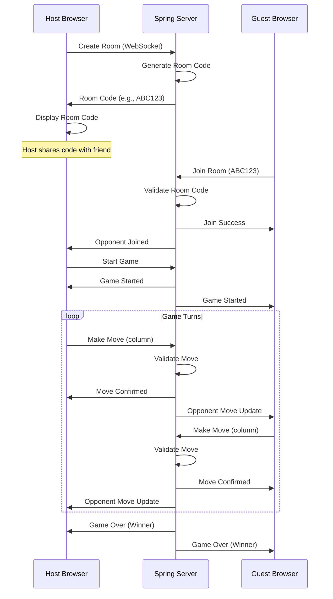
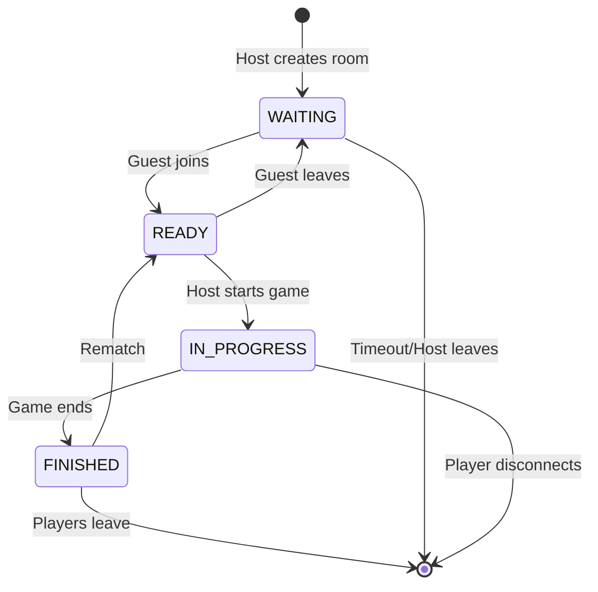
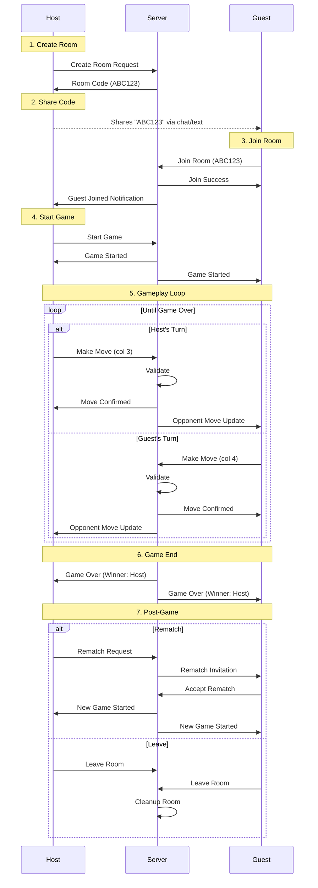

# Connect 4 Multiplayer Architecture Plan - Version 1.3

## Executive Summary

This document outlines the architecture for implementing **real-time multiplayer** functionality in the Connect 4 game. The multiplayer system will use a **room code-based approach** where a host creates a game room and shares a unique room code with a friend to join.

**Current Version:** 1.1 (labeled as 1.2)  
**Target Version:** 1.3  
**Primary Feature:** Online Multiplayer with Room Codes

---

## Table of Contents

1. [Current Architecture Overview](#current-architecture-overview)
2. [Multiplayer Requirements](#multiplayer-requirements)
3. [Technology Stack](#technology-stack)
4. [System Architecture](#system-architecture)
5. [Backend Implementation](#backend-implementation)
6. [Frontend Implementation](#frontend-implementation)
7. [Communication Protocol](#communication-protocol)
8. [Room Management System](#room-management-system)
9. [Game Flow](#game-flow)
10. [Security Considerations](#security-considerations)
11. [Error Handling](#error-handling)
12. [Testing Strategy](#testing-strategy)
13. [Deployment Considerations](#deployment-considerations)
14. [Future Enhancements](#future-enhancements)

---

## Current Architecture Overview

### Existing Components

#### Frontend (JavaScript)
- **Location:** `frontend/js/`
- **Key Files:**
  - `game-logic.js` - Client-side game logic with AI
  - `menu.js` - Menu controller for game configuration
  - `stats-manager.js` - Player statistics tracking
  - `theme-selector.js` - Theme management
  - `config.js` - Configuration management
  - `api.js` - API client (currently for local game logic)

#### Backend (Java Spring Boot)
- **Location:** `backend/src/main/java/com/connect4/`
- **Current Status:** Exists but game runs client-side
- **Components:**
  - Controllers, Services, Models, DTOs
  - Game engine for server-side validation

#### Current Game Modes
1. **Player vs Player** (Local)
2. **Player vs AI** (5 difficulty levels)
3. **AI vs AI** (Spectator mode)

---

## Multiplayer Requirements

### Functional Requirements

1. **Room Creation**
   - Host creates a new multiplayer room
   - System generates unique 6-character room code (e.g., `ABC123`)
   - Host can configure game settings (theme, first player)
   - Room expires after 1 hour of inactivity

2. **Room Joining**
   - Player enters room code to join
   - System validates room code and availability
   - Player joins as opponent (Player 2)
   - Room becomes locked once 2 players are connected

3. **Real-time Gameplay**
   - Synchronize game state between players
   - Turn-based move validation
   - Real-time board updates
   - Win/draw detection synchronized

4. **Player Management**
   - Display opponent's name
   - Show connection status
   - Handle disconnections gracefully
   - Reconnection support (optional for v1.3)

5. **Game Completion**
   - Update statistics for both players
   - Option to rematch in same room
   - Return to menu

### Non-Functional Requirements

1. **Performance**
   - Move latency < 200ms
   - Support 100+ concurrent rooms
   - Efficient WebSocket connection management

2. **Reliability**
   - Handle network interruptions
   - Validate all moves server-side
   - Prevent cheating/tampering

3. **Usability**
   - Simple room code sharing (copy button)
   - Clear connection status indicators
   - Intuitive waiting room UI

---

## Technology Stack

### Backend Additions

| Component | Technology | Purpose |
|-----------|-----------|---------|
| **WebSocket Server** | Spring WebSocket + STOMP | Real-time bidirectional communication |
| **Message Broker** | Spring's Simple Broker | Message routing between clients |
| **Room Management** | In-memory Map (ConcurrentHashMap) | Store active game rooms |
| **Session Management** | WebSocket Sessions | Track connected players |

### Frontend Additions

| Component | Technology | Purpose |
|-----------|-----------|---------|
| **WebSocket Client** | SockJS + STOMP.js | WebSocket connection with fallback |
| **Multiplayer UI** | HTML/CSS/JS | Room creation/joining interface |
| **Connection Manager** | JavaScript Class | Handle WebSocket lifecycle |
| **State Synchronization** | Event-driven updates | Keep game state in sync |

### Why WebSocket?

- **Real-time:** Instant move updates without polling
- **Bidirectional:** Server can push updates to clients
- **Efficient:** Persistent connection, low overhead
- **Spring Support:** Excellent integration with Spring Boot

---

## System Architecture

### High-Level Architecture Diagram

```
┌─────────────────────────────────────────────────────────────┐
│                        Frontend (Browser)                    │
├─────────────────────────────────────────────────────────────┤
│  ┌──────────────┐  ┌──────────────┐  ┌──────────────┐      │
│  │  Menu UI     │  │  Room UI     │  │  Game UI     │      │
│  │  (menu.js)   │  │ (multiplayer │  │  (game.js)   │      │
│  │              │  │    -ui.js)   │  │              │      │
│  └──────────────┘  └──────────────┘  └──────────────┘      │
│         │                  │                  │              │
│         └──────────────────┴──────────────────┘              │
│                            │                                 │
│                  ┌─────────▼─────────┐                      │
│                  │ WebSocket Manager │                      │
│                  │  (ws-client.js)   │                      │
│                  └─────────┬─────────┘                      │
└────────────────────────────┼─────────────────────────────────┘
                             │
                    WebSocket/SockJS
                             │
┌────────────────────────────▼─────────────────────────────────┐
│                   Backend (Spring Boot)                      │
├─────────────────────────────────────────────────────────────┤
│  ┌──────────────────────────────────────────────────────┐  │
│  │           WebSocket Configuration                     │  │
│  │         (WebSocketConfig.java)                        │  │
│  └──────────────────────────────────────────────────────┘  │
│                            │                                 │
│  ┌─────────────────────────┼─────────────────────────────┐ │
│  │                         │                              │ │
│  │  ┌──────────────┐  ┌───▼──────────┐  ┌────────────┐  │ │
│  │  │ Room Manager │  │   Game       │  │  Message   │  │ │
│  │  │   Service    │  │ Controller   │  │  Handler   │  │ │
│  │  │              │  │ (WebSocket)  │  │            │  │ │
│  │  └──────────────┘  └──────────────┘  └────────────┘  │ │
│  │         │                  │                 │         │ │
│  │         └──────────────────┴─────────────────┘         │ │
│  │                            │                            │ │
│  │                  ┌─────────▼─────────┐                 │ │
│  │                  │   Game Engine     │                 │ │
│  │                  │  (Validation)     │                 │ │
│  │                  └───────────────────┘                 │ │
│  │                                                         │ │
│  └─────────────────────────────────────────────────────────┘ │
│                                                               │
│  ┌─────────────────────────────────────────────────────────┐ │
│  │              Room Storage (In-Memory)                   │ │
│  │         ConcurrentHashMap<RoomCode, GameRoom>           │ │
│  └─────────────────────────────────────────────────────────┘ │
└───────────────────────────────────────────────────────────────┘
```

### Component Interaction Flow



---

## Backend Implementation

### 1. WebSocket Configuration

**File:** `backend/src/main/java/com/connect4/config/WebSocketConfig.java`

```java
@Configuration
@EnableWebSocketMessageBroker
public class WebSocketConfig implements WebSocketMessageBrokerConfigurer {
    
    @Override
    public void configureMessageBroker(MessageBrokerRegistry config) {
        // Enable simple broker for pub/sub
        config.enableSimpleBroker("/topic", "/queue");
        // Prefix for client messages
        config.setApplicationDestinationPrefixes("/app");
    }
    
    @Override
    public void registerStompEndpoints(StompEndpointRegistry registry) {
        // WebSocket endpoint with SockJS fallback
        registry.addEndpoint("/ws")
                .setAllowedOriginPatterns("*")
                .withSockJS();
    }
}
```

### 2. Room Management Service

**File:** `backend/src/main/java/com/connect4/service/RoomService.java`

```java
@Service
public class RoomService {
    
    private final Map<String, GameRoom> rooms = new ConcurrentHashMap<>();
    private final Random random = new Random();
    
    /**
     * Creates a new game room with unique code
     */
    public GameRoom createRoom(String hostName, RoomConfig config) {
        String roomCode = generateRoomCode();
        
        GameRoom room = GameRoom.builder()
            .roomCode(roomCode)
            .hostId(hostName)
            .config(config)
            .status(RoomStatus.WAITING)
            .createdAt(Instant.now())
            .expiresAt(Instant.now().plus(1, ChronoUnit.HOURS))
            .build();
        
        rooms.put(roomCode, room);
        scheduleRoomCleanup(roomCode);
        
        return room;
    }
    
    /**
     * Joins an existing room
     */
    public GameRoom joinRoom(String roomCode, String guestName) 
            throws RoomNotFoundException, RoomFullException {
        
        GameRoom room = rooms.get(roomCode);
        
        if (room == null) {
            throw new RoomNotFoundException("Room not found: " + roomCode);
        }
        
        if (room.getStatus() != RoomStatus.WAITING) {
            throw new RoomFullException("Room is full or game in progress");
        }
        
        room.setGuestId(guestName);
        room.setStatus(RoomStatus.READY);
        
        return room;
    }
    
    /**
     * Generates unique 6-character room code
     */
    private String generateRoomCode() {
        String chars = "ABCDEFGHJKLMNPQRSTUVWXYZ23456789"; // Avoid confusing chars
        StringBuilder code = new StringBuilder();
        
        do {
            code.setLength(0);
            for (int i = 0; i < 6; i++) {
                code.append(chars.charAt(random.nextInt(chars.length())));
            }
        } while (rooms.containsKey(code.toString()));
        
        return code.toString();
    }
    
    /**
     * Removes expired rooms
     */
    @Scheduled(fixedRate = 300000) // Every 5 minutes
    public void cleanupExpiredRooms() {
        Instant now = Instant.now();
        rooms.entrySet().removeIf(entry -> 
            entry.getValue().getExpiresAt().isBefore(now)
        );
    }
}
```

### 3. WebSocket Game Controller

**File:** `backend/src/main/java/com/connect4/controller/MultiplayerController.java`

```java
@Controller
public class MultiplayerController {
    
    @Autowired
    private RoomService roomService;
    
    @Autowired
    private GameService gameService;
    
    @Autowired
    private SimpMessagingTemplate messagingTemplate;
    
    /**
     * Create a new multiplayer room
     */
    @MessageMapping("/room/create")
    @SendToUser("/queue/room")
    public RoomResponse createRoom(@Payload CreateRoomRequest request, 
                                    Principal principal) {
        GameRoom room = roomService.createRoom(
            request.getHostName(), 
            request.getConfig()
        );
        
        return RoomResponse.builder()
            .roomCode(room.getRoomCode())
            .status("CREATED")
            .message("Room created successfully")
            .build();
    }
    
    /**
     * Join an existing room
     */
    @MessageMapping("/room/join")
    @SendToUser("/queue/room")
    public RoomResponse joinRoom(@Payload JoinRoomRequest request) {
        try {
            GameRoom room = roomService.joinRoom(
                request.getRoomCode(), 
                request.getGuestName()
            );
            
            // Notify host that guest joined
            messagingTemplate.convertAndSend(
                "/topic/room/" + room.getRoomCode(),
                new RoomUpdateMessage("GUEST_JOINED", request.getGuestName())
            );
            
            return RoomResponse.builder()
                .roomCode(room.getRoomCode())
                .status("JOINED")
                .hostName(room.getHostId())
                .build();
                
        } catch (RoomNotFoundException | RoomFullException e) {
            return RoomResponse.builder()
                .status("ERROR")
                .message(e.getMessage())
                .build();
        }
    }
    
    /**
     * Make a move in multiplayer game
     */
    @MessageMapping("/game/move")
    public void makeMove(@Payload MoveRequest request, Principal principal) {
        String roomCode = request.getRoomCode();
        
        try {
            // Validate and process move
            MoveResponse response = gameService.processMultiplayerMove(
                roomCode, 
                request.getColumn(), 
                principal.getName()
            );
            
            // Broadcast move to both players
            messagingTemplate.convertAndSend(
                "/topic/game/" + roomCode,
                response
            );
            
        } catch (InvalidMoveException e) {
            // Send error to player who made invalid move
            messagingTemplate.convertAndSendToUser(
                principal.getName(),
                "/queue/errors",
                new ErrorMessage(e.getMessage())
            );
        }
    }
}
```

### 4. Data Models

**File:** `backend/src/main/java/com/connect4/model/GameRoom.java`

```java
@Data
@Builder
public class GameRoom {
    private String roomCode;
    private String hostId;
    private String guestId;
    private RoomStatus status;
    private RoomConfig config;
    private Game game;
    private Instant createdAt;
    private Instant expiresAt;
}

enum RoomStatus {
    WAITING,    // Waiting for guest
    READY,      // Both players connected
    IN_PROGRESS, // Game started
    FINISHED    // Game completed
}
```

**File:** `backend/src/main/java/com/connect4/dto/CreateRoomRequest.java`

```java
@Data
public class CreateRoomRequest {
    private String hostName;
    private RoomConfig config;
}

@Data
public class RoomConfig {
    private String theme;
    private String firstPlayer; // "HOST", "GUEST", "RANDOM"
    private PlayerColor hostColor;
    private PlayerColor guestColor;
}
```

---

## Frontend Implementation

### 1. WebSocket Client Manager

**File:** `frontend/js/ws-client.js`

```javascript
class WebSocketClient {
    constructor() {
        this.stompClient = null;
        this.connected = false;
        this.roomCode = null;
        this.subscriptions = [];
    }
    
    /**
     * Connect to WebSocket server
     */
    connect(onConnected, onError) {
        const socket = new SockJS('http://localhost:8080/ws');
        this.stompClient = Stomp.over(socket);
        
        this.stompClient.connect({}, 
            (frame) => {
                this.connected = true;
                console.log('WebSocket connected:', frame);
                if (onConnected) onConnected();
            },
            (error) => {
                this.connected = false;
                console.error('WebSocket error:', error);
                if (onError) onError(error);
            }
        );
    }
    
    /**
     * Create a new room
     */
    createRoom(hostName, config, callback) {
        if (!this.connected) {
            throw new Error('Not connected to server');
        }
        
        // Subscribe to room responses
        this.stompClient.subscribe('/user/queue/room', (message) => {
            const response = JSON.parse(message.body);
            callback(response);
        });
        
        // Send create room request
        this.stompClient.send('/app/room/create', {}, JSON.stringify({
            hostName: hostName,
            config: config
        }));
    }
    
    /**
     * Join an existing room
     */
    joinRoom(roomCode, guestName, callback) {
        if (!this.connected) {
            throw new Error('Not connected to server');
        }
        
        this.roomCode = roomCode;
        
        // Subscribe to room responses
        this.stompClient.subscribe('/user/queue/room', (message) => {
            const response = JSON.parse(message.body);
            callback(response);
        });
        
        // Subscribe to room updates
        this.subscribeToRoom(roomCode);
        
        // Send join request
        this.stompClient.send('/app/room/join', {}, JSON.stringify({
            roomCode: roomCode,
            guestName: guestName
        }));
    }
    
    /**
     * Subscribe to room updates
     */
    subscribeToRoom(roomCode) {
        const subscription = this.stompClient.subscribe(
            `/topic/room/${roomCode}`, 
            (message) => {
                const update = JSON.parse(message.body);
                this.handleRoomUpdate(update);
            }
        );
        this.subscriptions.push(subscription);
    }
    
    /**
     * Subscribe to game updates
     */
    subscribeToGame(roomCode, onMove, onGameOver) {
        const subscription = this.stompClient.subscribe(
            `/topic/game/${roomCode}`,
            (message) => {
                const response = JSON.parse(message.body);
                
                if (response.gameStatus === 'IN_PROGRESS') {
                    onMove(response);
                } else {
                    onGameOver(response);
                }
            }
        );
        this.subscriptions.push(subscription);
    }
    
    /**
     * Send move to server
     */
    sendMove(roomCode, column) {
        this.stompClient.send('/app/game/move', {}, JSON.stringify({
            roomCode: roomCode,
            column: column
        }));
    }
    
    /**
     * Disconnect from server
     */
    disconnect() {
        if (this.stompClient) {
            this.subscriptions.forEach(sub => sub.unsubscribe());
            this.subscriptions = [];
            this.stompClient.disconnect();
            this.connected = false;
        }
    }
}

// Export singleton
const wsClient = new WebSocketClient();
```

### 2. Multiplayer UI Components

**File:** `frontend/js/multiplayer-ui.js`

```javascript
class MultiplayerUI {
    constructor() {
        this.wsClient = wsClient;
        this.currentRoom = null;
        this.isHost = false;
    }
    
    /**
     * Show create room dialog
     */
    showCreateRoomDialog() {
        const playerName = document.getElementById('player1Name').value.trim();
        
        if (!playerName) {
            alert('Please enter your name first');
            return;
        }
        
        // Connect to WebSocket
        this.wsClient.connect(
            () => {
                // Create room
                const config = this.buildRoomConfig();
                this.wsClient.createRoom(playerName, config, (response) => {
                    if (response.status === 'CREATED') {
                        this.showWaitingRoom(response.roomCode, true);
                    } else {
                        alert('Error creating room: ' + response.message);
                    }
                });
            },
            (error) => {
                alert('Connection error. Please try again.');
            }
        );
    }
    
    /**
     * Show join room dialog
     */
    showJoinRoomDialog() {
        const roomCode = prompt('Enter room code:');
        
        if (!roomCode) return;
        
        const playerName = document.getElementById('player1Name').value.trim();
        
        if (!playerName) {
            alert('Please enter your name first');
            return;
        }
        
        // Connect and join
        this.wsClient.connect(
            () => {
                this.wsClient.joinRoom(roomCode.toUpperCase(), playerName, (response) => {
                    if (response.status === 'JOINED') {
                        this.showWaitingRoom(roomCode, false);
                    } else {
                        alert('Error joining room: ' + response.message);
                    }
                });
            },
            (error) => {
                alert('Connection error. Please try again.');
            }
        );
    }
    
    /**
     * Display waiting room
     */
    showWaitingRoom(roomCode, isHost) {
        this.currentRoom = roomCode;
        this.isHost = isHost;
        
        // Hide menu, show waiting room
        document.getElementById('modeSelection').classList.add('hidden');
        document.getElementById('playerConfig').classList.add('hidden');
        
        const waitingRoom = document.getElementById('waitingRoom');
        waitingRoom.classList.remove('hidden');
        
        // Display room code
        document.getElementById('displayRoomCode').textContent = roomCode;
        
        if (isHost) {
            document.getElementById('waitingMessage').textContent = 
                'Waiting for opponent to join...';
            
            // Subscribe to room updates
            this.wsClient.subscribeToRoom(roomCode);
        } else {
            document.getElementById('waitingMessage').textContent = 
                'Waiting for host to start game...';
        }
    }
    
    /**
     * Copy room code to clipboard
     */
    copyRoomCode() {
        const roomCode = document.getElementById('displayRoomCode').textContent;
        navigator.clipboard.writeText(roomCode).then(() => {
            // Show copied feedback
            const btn = document.getElementById('copyCodeBtn');
            const originalText = btn.textContent;
            btn.textContent = '✓ Copied!';
            setTimeout(() => {
                btn.textContent = originalText;
            }, 2000);
        });
    }
    
    /**
     * Start multiplayer game
     */
    startMultiplayerGame() {
        // Subscribe to game updates
        this.wsClient.subscribeToGame(
            this.currentRoom,
            (moveResponse) => this.handleOpponentMove(moveResponse),
            (gameOverResponse) => this.handleGameOver(gameOverResponse)
        );
        
        // Navigate to game
        window.location.href = `game.html?mode=multiplayer&room=${this.currentRoom}`;
    }
}

// Initialize
const multiplayerUI = new MultiplayerUI();
```

### 3. Menu Integration

**Modifications to:** `frontend/js/menu.js`

Add multiplayer mode card and handlers:

```javascript
// Add to handleGameModeSelection
if (mode === 'multiplayer') {
    multiplayerUI.showCreateRoomDialog();
} else if (mode === 'join') {
    multiplayerUI.showJoinRoomDialog();
}
```

### 4. Game Integration

**Modifications to:** `frontend/js/game.js`

```javascript
// Detect multiplayer mode
const urlParams = new URLSearchParams(window.location.search);
const isMultiplayer = urlParams.get('mode') === 'multiplayer';
const roomCode = urlParams.get('room');

if (isMultiplayer) {
    // Use WebSocket for moves instead of local game logic
    this.makeMove = (column) => {
        wsClient.sendMove(roomCode, column);
    };
    
    // Listen for opponent moves
    wsClient.subscribeToGame(roomCode, 
        (response) => {
            this.updateBoard(response.board);
            this.updateCurrentPlayer(response.currentPlayer);
        },
        (response) => {
            this.handleGameOver(response);
        }
    );
}
```

---

## Communication Protocol

### Message Types

#### 1. Room Creation

**Client → Server**
```json
{
  "type": "CREATE_ROOM",
  "payload": {
    "hostName": "Alice",
    "config": {
      "theme": "classic",
      "firstPlayer": "RANDOM",
      "hostColor": "RED",
      "guestColor": "YELLOW"
    }
  }
}
```

**Server → Client**
```json
{
  "type": "ROOM_CREATED",
  "payload": {
    "roomCode": "ABC123",
    "status": "WAITING",
    "expiresAt": "2024-12-10T15:56:28Z"
  }
}
```

#### 2. Room Join

**Client → Server**
```json
{
  "type": "JOIN_ROOM",
  "payload": {
    "roomCode": "ABC123",
    "guestName": "Bob"
  }
}
```

**Server → All in Room**
```json
{
  "type": "PLAYER_JOINED",
  "payload": {
    "guestName": "Bob",
    "status": "READY"
  }
}
```

#### 3. Game Move

**Client → Server**
```json
{
  "type": "MAKE_MOVE",
  "payload": {
    "roomCode": "ABC123",
    "column": 3
  }
}
```

**Server → All in Room**
```json
{
  "type": "MOVE_MADE",
  "payload": {
    "player": "RED",
    "column": 3,
    "row": 5,
    "board": [[...], ...],
    "currentPlayer": "YELLOW",
    "gameStatus": "IN_PROGRESS"
  }
}
```

#### 4. Game Over

**Server → All in Room**
```json
{
  "type": "GAME_OVER",
  "payload": {
    "winner": "RED",
    "winnerName": "Alice",
    "gameStatus": "RED_WINS",
    "board": [[...], ...]
  }
}
```

---

## Room Management System

### Room Lifecycle



### Room Code Generation

- **Format:** 6 alphanumeric characters
- **Character Set:** `ABCDEFGHJKLMNPQRSTUVWXYZ23456789` (excludes confusing chars like O/0, I/1)
- **Uniqueness:** Check against existing rooms
- **Example Codes:** `ABC123`, `XYZ789`, `QWE456`

### Room Expiration

- **Default TTL:** 1 hour from creation
- **Cleanup Job:** Runs every 5 minutes
- **Extension:** Reset TTL on game activity
- **Manual Cleanup:** When both players leave

---

## Game Flow

### Multiplayer Game Sequence



---

## Security Considerations

### 1. Input Validation

- **Room Codes:** Validate format and existence
- **Moves:** Server-side validation (column range, turn order, column full)
- **Player Names:** Sanitize to prevent XSS
- **Rate Limiting:** Prevent spam/DoS

### 2. Authentication (Future)

- **Current:** Name-based (no auth)
- **Future:** JWT tokens, user accounts
- **Session Management:** WebSocket session IDs

### 3. Cheating Prevention

- **Server Authority:** All game logic on server
- **Move Validation:** Check turn order, valid moves
- **State Integrity:** Server maintains single source of truth
- **Reconnection:** Validate player identity on reconnect

### 4. Data Privacy

- **No Persistence:** Rooms are in-memory only (v1.3)
- **No PII:** Only player names stored temporarily
- **CORS:** Configure allowed origins properly

---

## Error Handling

### Client-Side Errors

| Error | Cause | Handling |
|-------|-------|----------|
| **Connection Failed** | Server down, network issue | Show retry button, fallback message |
| **Room Not Found** | Invalid/expired code | Clear error message, return to menu |
| **Room Full** | Already 2 players | Inform user, suggest creating new room |
| **Invalid Move** | Column full, wrong turn | Visual feedback, prevent move |
| **Disconnection** | Network interruption | Show reconnecting spinner, attempt reconnect |

### Server-Side Errors

| Error | Cause | Response |
|-------|-------|----------|
| **Invalid Room Code** | Malformed code | 400 Bad Request |
| **Room Expired** | TTL exceeded | 404 Not Found |
| **Unauthorized Move** | Not player's turn | 403 Forbidden |
| **Game State Mismatch** | Sync issue | Resend full state |

### Error Messages

```javascript
const ERROR_MESSAGES = {
    CONNECTION_FAILED: 'Unable to connect to server. Please check your internet connection.',
    ROOM_NOT_FOUND: 'Room not found. Please check the code and try again.',
    ROOM_FULL: 'This room is full. Please create a new room.',
    INVALID_MOVE: 'Invalid move. Please try again.',
    OPPONENT_DISCONNECTED: 'Your opponent has disconnected.',
    SERVER_ERROR: 'Server error. Please try again later.'
};
```

---

## Testing Strategy

### Unit Tests

**Backend**
- Room code generation uniqueness
- Move validation logic
- Win detection algorithm
- Room expiration cleanup

**Frontend**
- WebSocket connection handling
- Message parsing
- UI state transitions

### Integration Tests

- Full room creation → join → game flow
- Disconnection and reconnection
- Multiple concurrent rooms
- Message broadcasting

### Manual Testing Checklist

- [ ] Create room and receive valid code
- [ ] Join room with valid code
- [ ] Join room with invalid code (error handling)
- [ ] Play full game to completion
- [ ] Test disconnection during game
- [ ] Test room expiration
- [ ] Test multiple concurrent games
- [ ] Test rematch functionality
- [ ] Copy room code to clipboard
- [ ] Mobile responsiveness

---

## Deployment Considerations

### Backend Deployment

**Requirements:**
- Java 17+
- WebSocket support
- Sticky sessions (if load balanced)

**Environment Variables:**
```properties
# WebSocket Configuration
websocket.allowed.origins=https://yourdomain.com
websocket.max.sessions=1000

# Room Configuration
room.default.ttl=3600
room.cleanup.interval=300000
```

**Scaling Considerations:**
- **Horizontal Scaling:** Requires Redis for room storage
- **Load Balancing:** Enable sticky sessions for WebSocket
- **Current:** Single server, in-memory storage

### Frontend Deployment

**Build Process:**
- No build step required (vanilla JS)
- Minify JS/CSS for production
- Update WebSocket URL to production endpoint

**CDN Requirements:**
- SockJS client library
- STOMP.js library

```html
<script src="https://cdn.jsdelivr.net/npm/sockjs-client@1/dist/sockjs.min.js"></script>
<script src="https://cdn.jsdelivr.net/npm/@stomp/stompjs@7/bundles/stomp.umd.min.js"></script>
```

### Monitoring

**Metrics to Track:**
- Active WebSocket connections
- Active rooms count
- Average game duration
- Error rates
- Message throughput

---

## Future Enhancements

### Version 1.4+

1. **Persistent Rooms**
   - Database storage for rooms
   - Room history and replay

2. **User Accounts**
   - Registration/login
   - Friend lists
   - Private messaging

3. **Matchmaking**
   - Quick match with random opponent
   - ELO rating system
   - Ranked matches

4. **Spectator Mode**
   - Watch ongoing games
   - Room browser

5. **Enhanced Features**
   - In-game chat
   - Emotes/reactions
   - Custom board themes per room
   - Time limits per move
   - Tournament mode

6. **Mobile App**
   - Native iOS/Android apps
   - Push notifications for turn reminders

---

## Implementation Checklist

### Phase 1: Backend Setup
- [ ] Add WebSocket dependencies to `pom.xml`
- [ ] Create `WebSocketConfig.java`
- [ ] Implement `RoomService.java`
- [ ] Create room models and DTOs
- [ ] Implement `MultiplayerController.java`
- [ ] Add room cleanup scheduler
- [ ] Write unit tests

### Phase 2: Frontend Setup
- [ ] Add SockJS and STOMP.js libraries
- [ ] Create `ws-client.js`
- [ ] Create `multiplayer-ui.js`
- [ ] Design waiting room UI
- [ ] Add multiplayer mode to menu
- [ ] Implement room code copy functionality

### Phase 3: Integration
- [ ] Integrate WebSocket with game UI
- [ ] Handle move synchronization
- [ ] Implement game over handling
- [ ] Add connection status indicators
- [ ] Handle disconnections gracefully

### Phase 4: Testing
- [ ] Unit tests for all components
- [ ] Integration tests for full flow
- [ ] Manual testing with 2 browsers
- [ ] Load testing with multiple rooms
- [ ] Mobile testing

### Phase 5: Polish
- [ ] Error message refinement
- [ ] Loading states and animations
- [ ] Responsive design for waiting room
- [ ] Documentation updates
- [ ] Deployment guide

---

## Conclusion

This architecture provides a solid foundation for implementing real-time multiplayer functionality in Connect 4 v1.3. The room code-based approach is simple, user-friendly, and requires no authentication, making it perfect for casual play with friends.

**Key Benefits:**
- ✅ Simple room code sharing
- ✅ Real-time synchronization
- ✅ Server-side validation
- ✅ Scalable architecture
- ✅ Graceful error handling

**Next Steps:**
1. Review and approve this architecture plan
2. Begin Phase 1 implementation
3. Iterate based on testing feedback
4. Deploy to production

Good luck with the implementation! 🎮🚀
